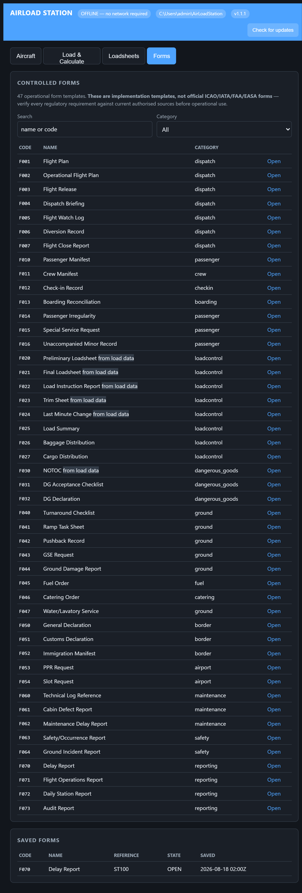
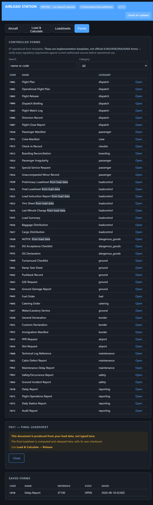

# AirLoad Station — Free Offline Aircraft Weight and Balance & Loadsheet Software

**Free load control software for airline stations.** Calculate aircraft weight
and balance, plot the CG envelope, and produce an IATA AHM 560 loadsheet — on
one Windows PC, with no internet connection, no database, and no licence fee.

[**⬇ Download the installer**](station/releases) · [Current version and checksum](station/latest.json)

---

<div align="center">

**[English](#english)** · **[العربية](#العربية)** · **[Türkçe](#türkçe)** ·
**[Русский](#русский)** · **[فارسی](#فارسی)**

</div>

---

### 47 controlled forms, searchable and fillable



### Documents produced from real load data are shown, not typed



---

## English

### What it does

AirLoad Station is **free weight and balance (W&B) software** for airline
ground handling and load control at outstations, small carriers, and charter
operators.

- **Aircraft weight and balance** — zero fuel weight, ramp, take-off and
  landing weights, moments, index, %MAC and the stabiliser trim setting,
  checked against the aircraft's certified CG envelope and structural limits.
- **CG envelope plotted on the printed loadsheet** — ZFW, TOW and LAW shown as
  points inside the envelope, so the captain can check the flight at a glance
  before signing rather than trusting a number.
- **IATA AHM 560 loadsheet** as a printable PDF and an AHM 565 Type B message.
- **Passenger counts, not kilograms** — enter adults, children and infants and
  IATA RP 1720 standard weights are applied, with the arithmetic shown so it
  can be checked.
- **Last minute change (LMC)** recorded against a released loadsheet, capped by
  your operations manual.
- **AHM 514 fuel index table** — ramp, take-off and landing each use the fuel
  arm for the quantity actually on board.
- **METAR and TAF** for the briefing when a connection happens to be available.
- **47 operational form templates** — dispatch, ground handling, dangerous
  goods, border, maintenance, safety and reporting.

### Why it is offline

A station has to dispatch the flight whether or not the network is up. Nothing
here calls out, nothing is stored in a cloud, and the app listens on this
computer only. Your aircraft configurations and released loadsheets are plain
JSON files in your user folder — back them up by copying the folder.

### What it deliberately does not do

- **It ships with no aircraft data.** Nothing is calculated until you load your
  own AHM 514 configuration. It will not guess an aircraft's weights, arms,
  envelope or trim table.
- **It will not release a loadsheet outside the CG envelope**, and it refuses a
  last minute change that breaches your cap, a structural limit, or the
  envelope — it requires a new loadsheet instead.
- **The forms are implementation templates, not official ICAO/IATA/FAA/EASA
  documents.** Verify every regulatory requirement against current authorised
  sources before operational use.
- **Standard weights ship as unapproved samples.** Replace them with your
  airline's approved table before using a loadsheet computed from them.

### Install

1. Download the installer and check its SHA-256 against
   [`station/latest.json`](station/latest.json):
   ```powershell
   Get-FileHash .\AirLoadStation-Setup-1.1.0.exe -Algorithm SHA256
   ```
2. Run it. A Node.js runtime is included — nothing else is needed.
3. Launch **AirLoad Station**, open the **Aircraft** tab, and paste your
   AHM 514 configuration.

> The installer is not code-signed, so Windows SmartScreen will warn on first
> run. Verifying the published SHA-256 above is the check that actually proves
> the file is the one we published.

### AirLoad Pro — the full departure control system

AirLoad Station is the free load control part of **AirLoad Pro**, a complete
Mini DCS for small airlines:

| | AirLoad Station (free) | AirLoad Pro |
|---|---|---|
| Weight & balance, loadsheet, LMC | ✅ | ✅ |
| CG envelope, trim, Type B | ✅ | ✅ |
| Operational forms | ✅ | ✅ |
| Passenger check-in, seat map | — | ✅ |
| Boarding, BCBP boarding passes (Res 792) | — | ✅ |
| Baggage acceptance, bag tags (Res 740) | — | ✅ |
| Air cargo, air waybills (Res 600a) | — | ✅ |
| Dangerous goods and NOTOC | — | ✅ |
| APIS / PNRGOV regulatory filing | — | ✅ |
| Type B messages (LDM, CPM, LIR, BSM, PTM) | — | ✅ |
| Multi-user, roles, audit trail | — | ✅ |
| Multi-airline, multi-station | — | ✅ |
| Mobile surface for gate and ramp | — | ✅ |
| Self-service kiosk | — | ✅ |

**To buy AirLoad Pro, request a demonstration, or ask about a deployment:**
📧 **mohammad.ghodrati@gmail.com**

---

## العربية

### برنامج مجاني لحساب الوزن والاتزان وإصدار ورقة الحمولة

**AirLoad Station** برنامج **مجاني لمراقبة الحمولة (Load Control)** لمحطات
شركات الطيران والمناولة الأرضية. يعمل على جهاز ويندوز واحد **بدون إنترنت**،
وبدون قاعدة بيانات، وبدون رسوم ترخيص.

- **حساب الوزن والاتزان** — الوزن الخالي من الوقود، ووزن الإقلاع والهبوط،
  والعزوم، ونسبة %MAC، وضبط مثبت الاتزان، مع التحقق من مظروف مركز الثقل
  والحدود الإنشائية للطائرة.
- **رسم مظروف مركز الثقل على ورقة الحمولة المطبوعة** — تظهر نقاط ZFW و TOW و
  LAW داخل المظروف ليتحقق منها القائد قبل التوقيع.
- **ورقة حمولة وفق IATA AHM 560** بصيغة PDF ورسالة Type B وفق AHM 565.
- **إدخال عدد الركاب بدل الكيلوغرامات** — بالغون وأطفال ورضّع، وتُطبَّق الأوزان
  القياسية IATA RP 1720 مع إظهار الحساب للتحقق منه.
- **التغيير في اللحظة الأخيرة (LMC)** يُسجَّل على ورقة حمولة صادرة، ضمن الحد
  المعتمد في دليل التشغيل.
- **جدول مؤشر الوقود AHM 514** — لكل مرحلة ذراع الوقود المطابق للكمية الفعلية.
- **تقارير METAR و TAF** عند توفر اتصال.
- **٤٧ نموذجاً تشغيلياً**.

### لماذا يعمل بدون إنترنت

يجب أن تُرسَل الرحلة سواء كانت الشبكة تعمل أم لا. لا يتصل البرنامج بأي خادم،
ولا يُخزَّن شيء في السحابة، ويستمع على هذا الجهاز فقط.

### ما لا يفعله عمداً

- **لا يأتي ببيانات طائرات.** لا يُحسب شيء قبل تحميل تهيئة AHM 514 الخاصة بك.
- **لا يصدر ورقة حمولة خارج المظروف**، ويرفض أي LMC يتجاوز الحد أو المظروف.
- **النماذج قوالب تنفيذية وليست وثائق رسمية** صادرة عن ICAO/IATA/FAA/EASA.
- **الأوزان القياسية عيّنات غير معتمدة** — استبدلها بجدول شركتك المعتمد.

### التثبيت

نزّل المثبِّت، وتحقق من بصمة SHA-256 من
[`station/latest.json`](station/latest.json)، ثم شغّله. بيئة Node.js مضمَّنة.

> المثبِّت غير موقَّع رقمياً، لذلك سيُظهر ويندوز تحذير SmartScreen عند أول
> تشغيل. التحقق من بصمة SHA-256 هو الإثبات الفعلي لسلامة الملف.

### AirLoad Pro — نظام مراقبة المغادرة الكامل

النسخة المجانية هي جزء مراقبة الحمولة من **AirLoad Pro**، وهو نظام DCS متكامل
يشمل تسجيل الركاب وخريطة المقاعد والصعود وبطاقات الصعود (Res 792) والأمتعة
(Res 740) والشحن الجوي (Res 600a) والبضائع الخطرة وNOTOC وإرسال APIS/PNRGOV
ورسائل Type B وتعدد المستخدمين والصلاحيات وسجل التدقيق.

📧 **للشراء أو طلب عرض توضيحي: mohammad.ghodrati@gmail.com**

---

## Türkçe

### Ücretsiz uçak ağırlık ve denge (W&B) ve yük föyü yazılımı

**AirLoad Station**, havayolu istasyonları ve yer hizmetleri için **ücretsiz
yük kontrol (load control) yazılımıdır**. Tek bir Windows bilgisayarda,
**internet olmadan**, veritabanı ve lisans ücreti olmadan çalışır.

- **Ağırlık ve denge hesabı** — yakıtsız ağırlık, kalkış ve iniş ağırlıkları,
  momentler, %MAC, stabilizatör trim ayarı; sertifikalı ağırlık merkezi
  zarfına ve yapısal limitlere karşı kontrol edilir.
- **Yük föyüne basılan CG zarfı** — ZFW, TOW ve LAW noktaları zarfın içinde
  gösterilir; kaptan imzalamadan önce bir bakışta doğrulayabilir.
- **IATA AHM 560 yük föyü** — yazdırılabilir PDF ve AHM 565 Type B mesajı.
- **Kilogram yerine yolcu sayısı** — yetişkin, çocuk ve bebek sayısı girilir,
  IATA RP 1720 standart ağırlıkları uygulanır ve hesap görünür şekilde gösterilir.
- **Son dakika değişikliği (LMC)** yayımlanmış yük föyüne işlenir.
- **AHM 514 yakıt indeks tablosu**, **METAR ve TAF**, **47 operasyonel form**.

### Neden çevrimdışı

Bir istasyonun uçuşu göndermesi gerekir; ağ çalışsın ya da çalışmasın. Yazılım
dışarı hiçbir bağlantı kurmaz ve yalnızca bu bilgisayarı dinler.

### Bilerek yapmadıkları

- **Uçak verisiyle gelmez.** Kendi AHM 514 konfigürasyonunuzu yüklemeden hiçbir
  hesap yapılmaz.
- **Zarf dışında yük föyü yayımlamaz**, limiti aşan LMC'yi reddeder.
- **Formlar resmî ICAO/IATA/FAA/EASA belgeleri değil**, uygulama şablonlarıdır.
- **Standart ağırlıklar onaysız örnektir** — havayolunuzun onaylı tablosuyla
  değiştirin.

### Kurulum

Kurulumu indirin, SHA-256 özetini
[`station/latest.json`](station/latest.json) ile karşılaştırın ve çalıştırın.
Node.js çalışma ortamı pakete dâhildir.

> Kurulum dosyası kod imzalı değildir; Windows SmartScreen ilk çalıştırmada
> uyarı verir. Gerçek doğrulama yayımlanan SHA-256 kontrolüdür.

### AirLoad Pro — tam kalkış kontrol sistemi

Ücretsiz sürüm, **AirLoad Pro**'nun yük kontrol bölümüdür. Pro; yolcu check-in,
koltuk haritası, biniş ve BCBP biniş kartları (Res 792), bagaj ve bagaj
etiketleri (Res 740), hava kargo (Res 600a), tehlikeli maddeler ve NOTOC,
APIS/PNRGOV bildirimi, Type B mesajları, çok kullanıcılı yetkilendirme ve
denetim kaydı içerir.

📧 **Satın alma ve demo için: mohammad.ghodrati@gmail.com**

---

## Русский

### Бесплатная программа центровки и загрузки самолёта (Weight and Balance)

**AirLoad Station** — **бесплатное программное обеспечение для контроля
загрузки** авиакомпаний и служб наземного обслуживания. Работает на одном
компьютере с Windows **без интернета**, без базы данных и без лицензионных
платежей.

- **Расчёт массы и центровки** — масса без топлива, взлётная и посадочная
  масса, моменты, индекс, %САХ и установка стабилизатора; проверка по
  сертифицированной центровочной диаграмме и конструктивным ограничениям.
- **Центровочная диаграмма на печатном сводном загрузочном листе** — точки ZFW,
  TOW и LAW внутри допустимой области, чтобы командир мог проверить перед
  подписанием.
- **Сводный загрузочный лист IATA AHM 560** — PDF и сообщение Type B (AHM 565).
- **Ввод количества пассажиров вместо килограммов** — применяются стандартные
  массы IATA RP 1720, расчёт показывается для проверки.
- **Изменения в последнюю минуту (LMC)**, **таблица индекса топлива AHM 514**,
  **METAR и TAF**, **47 операционных форм**.

### Почему офлайн

Рейс должен быть отправлен независимо от того, работает ли сеть. Программа
никуда не обращается и слушает только этот компьютер.

### Чего он намеренно не делает

- **Не содержит данных о самолётах.** Расчёт невозможен, пока вы не загрузите
  собственную конфигурацию AHM 514.
- **Не выпускает загрузочный лист вне допустимой центровки** и отклоняет LMC,
  превышающее ваш предел.
- **Формы — шаблоны реализации, а не официальные документы** ICAO/IATA/FAA/EASA.
- **Стандартные массы — неутверждённые образцы.**

### Установка

Скачайте установщик, сверьте SHA-256 с
[`station/latest.json`](station/latest.json) и запустите. Среда Node.js входит
в комплект.

> Установщик не подписан цифровой подписью, поэтому Windows SmartScreen выдаст
> предупреждение при первом запуске. Настоящая проверка — сверка SHA-256.

### AirLoad Pro — полная система управления вылетом

Бесплатная версия — это часть контроля загрузки системы **AirLoad Pro**: полная
DCS с регистрацией пассажиров, картой мест, посадкой и посадочными талонами
BCBP (Res 792), багажом и бирками (Res 740), грузовыми авианакладными
(Res 600a), опасными грузами и NOTOC, передачей APIS/PNRGOV, сообщениями
Type B, ролями и журналом аудита.

📧 **Покупка и демонстрация: mohammad.ghodrati@gmail.com**

---

## فارسی

### نرم‌افزار رایگان وزن و تعادل هواپیما و صدور لودشیت

**AirLoad Station** یک **نرم‌افزار رایگان کنترل بار (Load Control)** برای
ایستگاه‌های شرکت‌های هواپیمایی و خدمات زمینی است. روی یک کامپیوتر ویندوزی،
**بدون اینترنت**، بدون دیتابیس و بدون هزینه‌ی لایسنس کار می‌کند.

- **محاسبه‌ی وزن و تعادل** — وزن بدون سوخت، وزن برخاست و فرود، ممان‌ها، ایندکس،
  درصد MAC و تنظیم تریم، با کنترل در برابر پاکت مرکز ثقل و حدود سازه‌ای هواپیما.
- **رسم پاکت CG روی لودشیت چاپی** — نقاط ZFW و TOW و LAW داخل پاکت نشان داده
  می‌شوند تا کاپیتان پیش از امضا با یک نگاه بررسی کند.
- **لودشیت مطابق IATA AHM 560** به‌صورت PDF و پیام Type B مطابق AHM 565.
- **ورود تعداد مسافر به‌جای کیلوگرم** — بزرگسال، کودک و نوزاد؛ وزن‌های استاندارد
  IATA RP 1720 اعمال و **محاسبه نمایش داده می‌شود** تا قابل بررسی باشد.
- **تغییر لحظه‌ی آخر (LMC)** روی لودشیت صادرشده، تا سقف دستورالعمل شما.
- **جدول ایندکس سوخت AHM 514** — هر مرحله بازوی سوختِ مقدار واقعی روی هواپیما.
- **METAR و TAF** هنگام وجود اتصال، و **۴۷ فرم عملیاتی**.

### چرا آفلاین

ایستگاه باید پرواز را بفرستد، چه شبکه کار کند چه نکند. نرم‌افزار هیچ تماس
بیرونی ندارد و فقط روی همین کامپیوتر گوش می‌دهد. تنظیمات هواپیما و لودشیت‌های
صادرشده فایل‌های ساده‌ی JSON در پوشه‌ی کاربر هستند.

### آنچه عمداً انجام نمی‌دهد

- **با هیچ داده‌ی هواپیمایی نمی‌آید.** تا تنظیمات AHM 514 خودتان را بارگذاری
  نکنید هیچ محاسبه‌ای انجام نمی‌شود.
- **لودشیت خارج از پاکت صادر نمی‌کند** و LMC بیش از سقف یا خارج از پاکت را رد
  می‌کند، نه اینکه هشدار بدهد و اجازه دهد.
- **فرم‌ها قالب پیاده‌سازی هستند، نه اسناد رسمی** ICAO/IATA/FAA/EASA.
- **وزن‌های استاندارد نمونه‌ی تأییدنشده‌اند** — با جدول تأییدشده‌ی شرکت خودتان
  جایگزین کنید.

### نصب

نصب‌کننده را دانلود کنید، مقدار SHA-256 را با
[`station/latest.json`](station/latest.json) بسنجید و اجرا کنید. محیط اجرایی
Node.js همراه بسته است.

> نصب‌کننده امضای دیجیتال ندارد، پس ویندوز در اجرای اول هشدار SmartScreen
> می‌دهد. بررسی SHA-256 منتشرشده تنها چیزی است که واقعاً سالم‌بودن فایل را
> اثبات می‌کند.

### AirLoad Pro — سیستم کامل کنترل پرواز

نسخه‌ی رایگان بخش کنترل بارِ **AirLoad Pro** است؛ یک DCS کامل شامل پذیرش مسافر،
نقشه‌ی صندلی، سوارشدن و کارت پرواز BCBP (Res 792)، پذیرش بار و تگ چمدان
(Res 740)، بار هوایی و بارنامه (Res 600a)، کالای خطرناک و NOTOC، ارسال
APIS/PNRGOV، پیام‌های Type B، چند-کاربره با نقش و سطح دسترسی، و سابقه‌ی ممیزی.

📧 **برای خرید یا درخواست دموی نرم‌افزار: mohammad.ghodrati@gmail.com**

---

## The 47 forms · النماذج · Formlar · Формы · فرم‌ها

Every form is included in the free version. Forms marked **⚙** describe
documents this system produces from your real load data, so they are shown
read-only rather than typed — a second set of figures for the same flight helps
nobody.

> **Implementation templates, not official ICAO/IATA/FAA/EASA documents.** ·
> قوالب تنفيذية وليست وثائق رسمية · Uygulama şablonları, resmî belge değildir ·
> Шаблоны реализации, не официальные документы · قالب پیاده‌سازی، نه سند رسمی

### Dispatch · الإرسال · Uçuş harekât · Диспетчеризация · دیسپچ

| | English | العربية | Türkçe | Русский | فارسی |
|---|---|---|---|---|---|
| F001 | Flight Plan | خطة الطيران | Uçuş Planı | План полёта | طرح پروازی |
| F002 | Operational Flight Plan | خطة الطيران التشغيلية | Operasyonel Uçuş Planı | Рабочий план полёта | طرح پروازی عملیاتی |
| F003 | Flight Release | إذن تشغيل الرحلة | Uçuş İzni | Разрешение на вылет | مجوز پرواز |
| F004 | Dispatch Briefing | إحاطة الإرسال | Harekât Brifingi | Диспетчерский брифинг | بریفینگ دیسپچ |
| F005 | Flight Watch Log | سجل متابعة الرحلة | Uçuş İzleme Kaydı | Журнал слежения за рейсом | لاگ پایش پرواز |
| F006 | Diversion Record | سجل تحويل الوجهة | Yön Değiştirme Kaydı | Запись об уходе на запасной | سابقه‌ی تغییر مسیر |
| F007 | Flight Close Report | تقرير إغلاق الرحلة | Uçuş Kapanış Raporu | Отчёт о закрытии рейса | گزارش بستن پرواز |

### Passenger, crew, check-in, boarding · الركاب والطاقم · Yolcu ve kabin · Пассажиры и экипаж · مسافر و خدمه

| | English | العربية | Türkçe | Русский | فارسی |
|---|---|---|---|---|---|
| F010 | Passenger Manifest | كشف الركاب | Yolcu Manifestosu | Список пассажиров | مانیفست مسافر |
| F011 | Crew Manifest | كشف الطاقم | Mürettebat Manifestosu | Список экипажа | مانیفست خدمه |
| F012 | Check-in Record | سجل تسجيل الوصول | Check-in Kaydı | Запись регистрации | سابقه‌ی پذیرش |
| F013 | Boarding Reconciliation | مطابقة الصعود | Biniş Mutabakatı | Сверка посадки | تطبیق سوارشدن |
| F014 | Passenger Irregularity | مخالفة تخص الراكب | Yolcu Düzensizliği | Нарушение по пассажиру | مغایرت مسافر |
| F015 | Special Service Request | طلب خدمة خاصة | Özel Hizmet Talebi | Запрос спецобслуживания | درخواست خدمت ویژه |
| F016 | Unaccompanied Minor Record | سجل القاصر غير المصحوب | Refakatsiz Çocuk Kaydı | Запись о несопровождаемом ребёнке | سابقه‌ی کودک بدون همراه |

### Load control · مراقبة الحمولة · Yük kontrol · Контроль загрузки · کنترل بار

| | English | العربية | Türkçe | Русский | فارسی |
|---|---|---|---|---|---|
| F020 ⚙ | Preliminary Loadsheet | ورقة الحمولة الأولية | Ön Yük Föyü | Предварительный загрузочный лист | لودشیت مقدماتی |
| F021 ⚙ | Final Loadsheet | ورقة الحمولة النهائية | Nihai Yük Föyü | Окончательный загрузочный лист | لودشیت نهایی |
| F022 ⚙ | Load Instruction Report | تقرير تعليمات التحميل | Yükleme Talimat Raporu | Указания по загрузке | دستور بارگیری |
| F023 ⚙ | Trim Sheet | ورقة الاتزان | Denge Föyü | Центровочный график | برگه‌ی تریم |
| F024 ⚙ | Last Minute Change | التغيير في اللحظة الأخيرة | Son Dakika Değişikliği | Изменение в последнюю минуту | تغییر لحظه‌ی آخر |
| F025 | Load Summary | ملخص الحمولة | Yük Özeti | Сводка загрузки | خلاصه‌ی بار |
| F026 | Baggage Distribution | توزيع الأمتعة | Bagaj Dağılımı | Распределение багажа | توزیع چمدان |
| F027 | Cargo Distribution | توزيع الشحن | Kargo Dağılımı | Распределение груза | توزیع بار هوایی |

### Dangerous goods · البضائع الخطرة · Tehlikeli maddeler · Опасные грузы · کالای خطرناک

| | English | العربية | Türkçe | Русский | فارسی |
|---|---|---|---|---|---|
| F030 ⚙ | NOTOC (Notification to Captain) | إشعار القائد | Kaptana Bildirim | Уведомление командиру | اعلام به کاپیتان |
| F031 | DG Acceptance Checklist | قائمة قبول البضائع الخطرة | TM Kabul Kontrol Listesi | Чек-лист приёма опасных грузов | چک‌لیست پذیرش DG |
| F032 | DG Declaration | إقرار البضائع الخطرة | TM Beyanı | Декларация опасных грузов | اظهارنامه‌ی DG |

### Ground handling, fuel, catering · المناولة والوقود والتموين · Yer hizmetleri, yakıt, ikram · Наземное обслуживание · خدمات زمینی، سوخت، پذیرایی

| | English | العربية | Türkçe | Русский | فارسی |
|---|---|---|---|---|---|
| F040 | Turnaround Checklist | قائمة فحص الاستدارة | Turnaround Kontrol Listesi | Чек-лист оборота | چک‌لیست turnaround |
| F041 | Ramp Task Sheet | ورقة مهام الساحة | Apron Görev Föyü | Задание перронной бригаде | برگه‌ی وظایف رمپ |
| F042 | Pushback Record | سجل الدفع للخلف | Pushback Kaydı | Запись буксировки | سابقه‌ی pushback |
| F043 | GSE Request | طلب معدات أرضية | GSE Talebi | Заявка на спецтехнику | درخواست تجهیزات زمینی |
| F044 | Ground Damage Report | تقرير أضرار أرضية | Yer Hasar Raporu | Отчёт о наземном повреждении | گزارش آسیب زمینی |
| F045 | Fuel Order | أمر التزود بالوقود | Yakıt Siparişi | Заявка на заправку | سفارش سوخت |
| F046 | Catering Order | أمر التموين | İkram Siparişi | Заявка на кейтеринг | سفارش پذیرایی |
| F047 | Water / Lavatory Service | خدمة المياه ودورات المياه | Su / Tuvalet Servisi | Обслуживание воды и туалетов | سرویس آب و توالت |

### Border and airport · الحدود والمطار · Sınır ve havalimanı · Границы и аэропорт · مرزی و فرودگاهی

| | English | العربية | Türkçe | Русский | فارسی |
|---|---|---|---|---|---|
| F050 | General Declaration (GenDec) | الإقرار العام | Genel Beyan | Генеральная декларация | اظهارنامه‌ی عمومی |
| F051 | Customs Declaration | الإقرار الجمركي | Gümrük Beyanı | Таможенная декларация | اظهارنامه‌ی گمرکی |
| F052 | Immigration Manifest | كشف الجوازات | Pasaport Manifestosu | Иммиграционный список | مانیفست گذرنامه |
| F053 | PPR Request | طلب إذن مسبق | PPR Talebi | Запрос PPR | درخواست PPR |
| F054 | Slot Request | طلب حصة زمنية | Slot Talebi | Запрос слота | درخواست اسلات |

### Maintenance and safety · الصيانة والسلامة · Bakım ve emniyet · ТО и безопасность · نگهداری و ایمنی

| | English | العربية | Türkçe | Русский | فارسی |
|---|---|---|---|---|---|
| F060 | Technical Log Reference | مرجع السجل الفني | Teknik Kayıt Referansı | Ссылка на техбортжурнал | ارجاع لاگ فنی |
| F061 | Cabin Defect Report | تقرير عيوب المقصورة | Kabin Arıza Raporu | Отчёт о дефекте салона | گزارش نقص کابین |
| F062 | Maintenance Delay Report | تقرير تأخير الصيانة | Bakım Gecikme Raporu | Отчёт о задержке по ТО | گزارش تأخیر نگهداری |
| F063 | Safety / Occurrence Report | تقرير السلامة والحوادث | Emniyet / Olay Raporu | Отчёт о происшествии | گزارش ایمنی و رخداد |
| F064 | Ground Incident Report | تقرير حادث أرضي | Yer Olay Raporu | Отчёт о наземном инциденте | گزارش سانحه‌ی زمینی |

### Reporting · التقارير · Raporlama · Отчётность · گزارش‌گیری

| | English | العربية | Türkçe | Русский | فارسی |
|---|---|---|---|---|---|
| F070 | Delay Report | تقرير التأخير | Gecikme Raporu | Отчёт о задержке | گزارش تأخیر |
| F071 | Flight Operations Report | تقرير عمليات الطيران | Uçuş Harekât Raporu | Отчёт по лётной эксплуатации | گزارش عملیات پرواز |
| F072 | Daily Station Report | التقرير اليومي للمحطة | Günlük İstasyon Raporu | Суточный отчёт станции | گزارش روزانه‌ی ایستگاه |
| F073 | Audit Report | تقرير التدقيق | Denetim Raporu | Отчёт аудита | گزارش ممیزی |

---

<div align="center">

**Keywords** · aircraft weight and balance software · free loadsheet software ·
load control software · IATA AHM 560 loadsheet · AHM 514 · centre of gravity
envelope · trim sheet · last minute change LMC · departure control system DCS ·
ground handling software · offline W&B · برنامج الوزن والاتزان · ورقة الحمولة ·
uçak ağırlık ve denge yazılımı · yük föyü · программа центровки самолёта ·
загрузочный лист · نرم‌افزار وزن و تعادل · لودشیت

</div>

---

This repository carries released installers and end-user documentation only.
The application source is not published here.

**Contact: mohammad.ghodrati@gmail.com**
